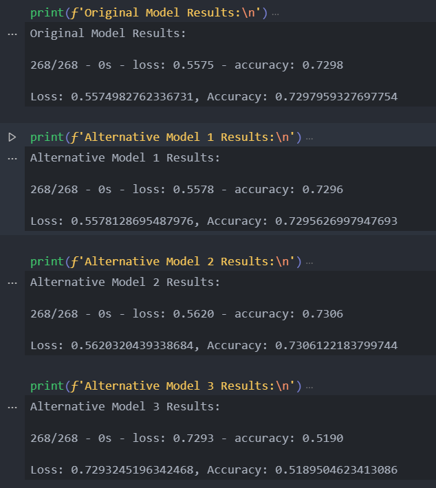

# The ABC's of Funding and Risk Management 

Welcome to the Module 13 Challenge Jupyter Notebook!

This challenge focuses on utilizing deep neural network binary classification models to gauge the potential success of venture capital firm Alphabet Soup's funding applications from various startups.

The training dataset consists of over 34,000 organizations that have received funding from the firm over the years as well as pertinent information about each startup at the time of initial funding.

In addition, due to the historical nature of the dataset, included is the firm's eventual determination of whether or not the startup was considered successful. 

## Technologies

This Jupyter Lab Notebook has available to it the modeules found in:

> `requirements.txt`

## Installation Guide

The most straightforward method for interacting with the included materials is from within an **anaconda environment**.

Instructions for installing anaconda may be found [here](https://www.anaconda.com/products/individual).

## Example

Once the jupyter notebook is open, the results of the models will appear similar to the example image:

## Usage

Once the necessary modules/libraries have been installed, launch the Jupyter Lab either via the command line or from within an IDE capable of opening the `.ipynb` file extension.

From there, all steps performed, accompanying outputs, and analysis can be observed in sequence from top to bottom.

## Contributors

Forrest Surles

## License

MIT License

Copyright (c) 2021 Forrest Surles

Permission is hereby granted, free of charge, to any person obtaining a copy of this software and associated documentation files (the "Software"), to deal in the Software without restriction, including without limitation the rights to use, copy, modify, merge, publish, distribute, sublicense, and/or sell copies of the Software, and to permit persons to whom the Software is furnished to do so, subject to the following conditions:

The above copyright notice and this permission notice shall be included in all copies or substantial portions of the Software.

THE SOFTWARE IS PROVIDED "AS IS", WITHOUT WARRANTY OF ANY KIND, EXPRESS OR IMPLIED, INCLUDING BUT NOT LIMITED TO THE WARRANTIES OF MERCHANTABILITY, FITNESS FOR A PARTICULAR PURPOSE AND NONINFRINGEMENT. IN NO EVENT SHALL THE AUTHORS OR COPYRIGHT HOLDERS BE LIABLE FOR ANY CLAIM, DAMAGES OR OTHER LIABILITY, WHETHER IN AN ACTION OF CONTRACT, TORT OR OTHERWISE, ARISING FROM, OUT OF OR IN CONNECTION WITH THE SOFTWARE OR THE USE OR OTHER DEALINGS IN THE SOFTWARE.